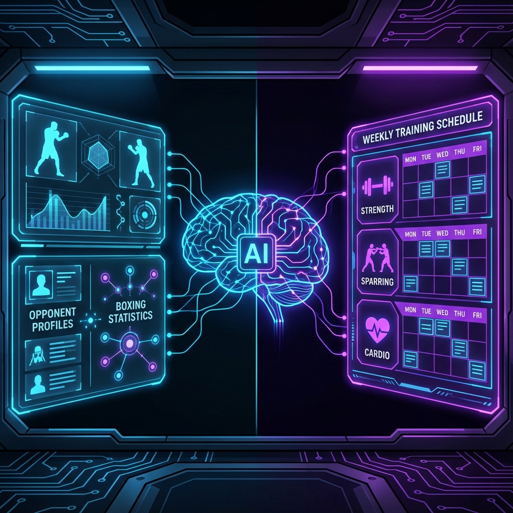
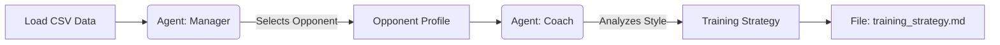

# Boxe1Project Crew: AI-Powered Boxing Strategy



## 🥊 Project Overview
**Boxe1Project Crew** is an advanced multi-agent AI system built on the **CrewAI** framework. It simulates a high-level boxing management and coaching team, interacting to make crucial career decisions for a professional boxer.

The project orchestrates autonomous agents to perform complex data analysis and strategic planning, replacing the traditional manual process of matchmaking and training program design with a data-driven AI approach.

### 🎯 Why this project?
In professional boxing, talent involves more than just throwing punches. Strategic career management is key. This project was developed to:
1.  **Optimize Matchmaking**: Automatically identify the ideal opponent by analyzing statistics (weight class, win/loss ratio, style) to ensure a fair yet competitive fight.
2.  **Tailor Training**: Move away from generic workouts. The system generates a custom 7-day training schedule specifically designed to exploit the chosen opponent's weaknesses and neutralize their strengths.
3.  **Automate Expertise**: Demonstrate the power of LLMs (Large Language Models) in simulating specific roles like "Sports Manager" and "Athletic Coach".

---

## ⚙️ How it Works

The system utilizes two specialized AI Agents working in a sequential workflow:

1.  **The Opponent Manager**:
    *   **Goal**: Select the perfect opponent.
    *   **Process**: It reads a database (`opponents.csv`) of potential fighters. It filters for the correct weight class and analyzes the "Ratio" (Wins/Losses). It applies strategic logic to pick an opponent that is beatable but offers a ranking reward (Ratio <= our boxer's Ratio).
    *   **Output**: A selected opponent profile with rationale.

2.  **The Training Coach**:
    *   **Goal**: Create a winning strategy.
    *   **Process**: It receives the selected opponent's data from the Manager. It analyzes their fighting style (e.g., Aggressive, Technical, Defensive) and synthesizes a weekly training plan.
    *   **Output**: A detailed Markdown report (`training_strategy.md`) containing tactical advice and a day-by-day workout schedule.

### Workflow Diagram



---

## 🚀 Getting Started

Follow these steps to set up and run the AI Crew locally.

### Prerequisites
*   **Python**: Version 3.10 to 3.12 (CrewAI requirement).
*   **UV**: A fast Python package installer and resolver (recommended).
*   **API Key**: An OpenAI API key (or other LLM provider supported by CrewAI) for the agents to function.

### Installation

1.  **Clone the Repository**
    ```bash
    git clone <repository_url>
    cd crewai_boxe_project
    ```

2.  **Install Dependencies**
    This project uses `uv` for efficient dependency management.
    ```bash
    pip install uv
    crewai install
    ```

3.  **Configure Environment**
    Create a `.env` file in the root directory and add your API key:
    ```env
    OPENAI_API_KEY=sk-your-api-key-here
    ```

### Execution

To launch the crew and start the analysis process:

```bash
crewai run
```
*Alternatively, you can run the python script directly:*
```bash
python src/boxe1_project/main.py
```

---

## 📄 Example Output
After running the command, the agents will collaborate in the terminal. Once finished, you will find a **`training_strategy.md`** file in the root directory.

**What you will see in the output file:**
*   **Style Analysis**: A breakdown of the opponent's "Aggressive" or "Technical" style.
*   **Tactical Priorities**: "Focus on counter-punching" or "Improve lateral movement".
*   **Weekly Schedule**:
    *   *Monday*: 45 min Interval Running + Footwork drills.
    *   *Tuesday*: Heavy Bag (Power focus) - 30 mins.
    *   ...
*   **Tactical Conclusion**: Final advice for fight night.

---

## 📂 Project Structure

*   `src/boxe1_project/config/agents.yaml`: Definitions of the Manager and Coach agents.
*   `src/boxe1_project/config/tasks.yaml`: Detailed instructions for the logical tasks.
*   `src/boxe1_project/main.py`: The entry point script that initiates the Crew.
*   `src/boxe1_project/crew.py`: The orchestration logic.
*   `training_strategy.md`: The final output generated by the AI.

---
*Built with ❤️ using [CrewAI](https://crewai.com)*
